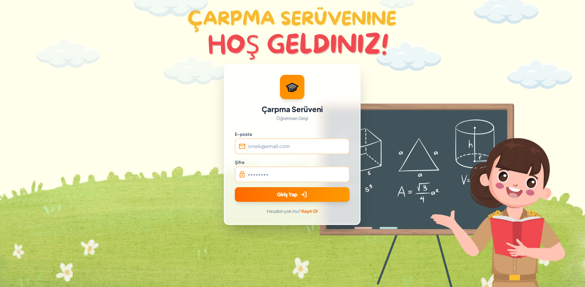
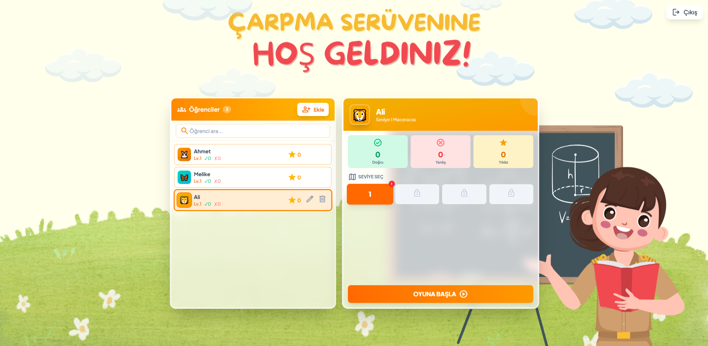
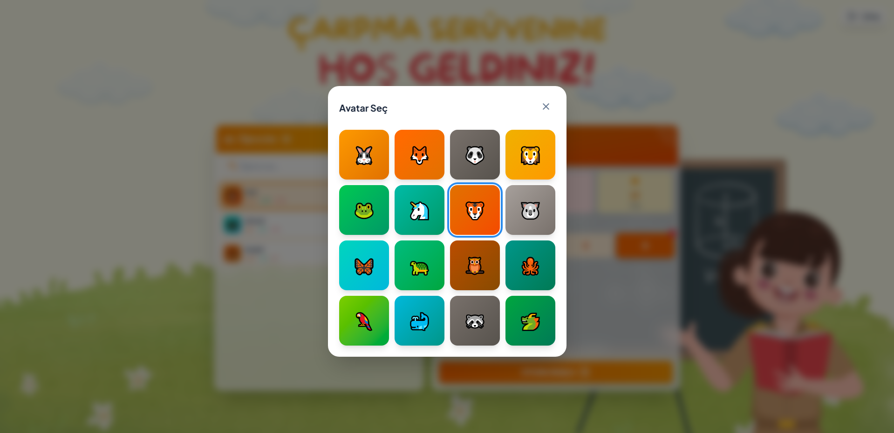
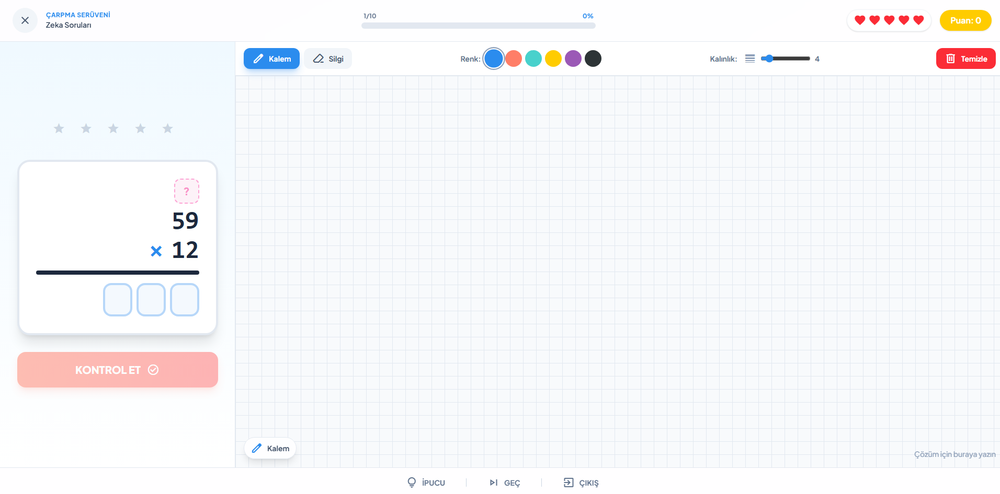

# Çarpma Serüveni

An interactive **Turkish multiplication game** designed for primary school math teachers. Teachers create accounts, manage their students, track each student's progress, and launch the game at the correct difficulty level with a single click.

---

## Screenshots

| Login | Dashboard |
|-------|-----------|
|  |  |

| Avatar Selection | Game Interface |
|-----------------|----------------|
|  |  |

---

## Features

- **4 Difficulty Levels**
  - Level 1 — 2-digit × 1-digit, result < 100
  - Level 2 — 2-digit × 1-digit, result 100–300
  - Level 3 — 3-digit × 1-digit
  - Level 4 — 2-digit × 2-digit, result 100–1000
- **Student Management** — add, delete, rename, and pick avatars for students
- **Progress Tracking** — correct / wrong counts, star score, and current level per student
- **Lives System** — 5 lives per session
- **Hint System** — reveals answer digits one at a time (right to left)
- **Drawing Canvas** — students can show their working on the right-hand panel
- **Sound Effects** — distinct tones for correct and wrong answers
- **Fully Responsive** — desktop, tablet, and mobile layouts

---

## Tech Stack

| Layer | Technology |
|-------|-----------|
| Framework | Next.js 16.2.9 (App Router) |
| UI | React 19, Tailwind CSS 4 |
| Language | TypeScript 5 |
| Database | Supabase (PostgreSQL) |
| Auth | Supabase Auth |
| Fonts | Baloo 2, Nunito, Material Symbols |

---

## Prerequisites

- **Node.js** ≥ 18
- **npm** ≥ 9
- A **[Supabase](https://supabase.com)** account and project

---

## Supabase Setup

### 1. Create the students table

Open the **SQL Editor** in your Supabase project and run:

```sql
create table public.students (
  id             uuid primary key,
  name           text not null,
  "currentLevel" integer not null default 1,
  "correctCount" integer not null default 0,
  "wrongCount"   integer not null default 0,
  "totalStars"   integer not null default 0,
  "avatarId"     integer not null default 0,
  user_id        uuid references auth.users(id) on delete cascade,
  created_at     timestamptz not null default now()
);
```

> `on delete cascade` ensures that when a teacher account is deleted, all their students are removed automatically.

### 2. Add performance index

```sql
create index idx_students_user_id on public.students(user_id);
```

### 3. Add data integrity constraints

```sql
alter table public.students
  add constraint chk_level  check ("currentLevel" between 1 and 4),
  add constraint chk_correct check ("correctCount" >= 0),
  add constraint chk_wrong   check ("wrongCount"   >= 0),
  add constraint chk_stars   check ("totalStars"   >= 0),
  add constraint chk_avatar  check ("avatarId"     between 0 and 15);
```

### 4. Enable Row Level Security

```sql
-- Enable RLS
alter table public.students enable row level security;

-- Each teacher can only access their own students
create policy "Users manage their own students"
  on public.students
  for all
  using (auth.uid() = user_id)
  with check (auth.uid() = user_id);
```

### 5. Disable email confirmation *(recommended for development)*

In Supabase dashboard: **Authentication → Providers → Email → turn off "Confirm email"**

This lets teachers sign up and log in immediately without needing to confirm their email address.

### 6. Get your API keys

In your Supabase dashboard go to **Project Settings → API**:

- **Project URL** → `NEXT_PUBLIC_SUPABASE_URL`
- **anon / public key** → `NEXT_PUBLIC_SUPABASE_ANON_KEY`

---

## Local Setup

### 1. Clone the repository

```bash
git clone <repo-url>
cd carpma-seruveni
```

### 2. Install dependencies

```bash
npm install
```

### 3. Configure environment variables

Copy the example file and fill in your Supabase credentials:

```bash
cp .env.example .env.local
```

Then edit `.env.local`:

```env
NEXT_PUBLIC_SUPABASE_URL=https://your-project-id.supabase.co
NEXT_PUBLIC_SUPABASE_ANON_KEY=your-anon-public-key-here
```

### 4. Start the development server

```bash
npm run dev
```

Open [http://localhost:3000](http://localhost:3000) in your browser.

---

## Production Build

```bash
# Build for production
npm run build

# Start the production server
npm start
```

---

## URL Routes

| Page | URL |
|------|-----|
| Teacher dashboard | `http://localhost:3000/` |
| Login | `http://localhost:3000/login` |
| Sign up | `http://localhost:3000/signup` |
| Game — level 1 | `http://localhost:3000/game/1?studentId=<id>` |
| Game — level 2 | `http://localhost:3000/game/2?studentId=<id>` |
| Game — level 3 | `http://localhost:3000/game/3?studentId=<id>` |
| Game — level 4 | `http://localhost:3000/game/4?studentId=<id>` |

> The `studentId` query parameter is set automatically when a teacher launches the game from the dashboard.

---

## Project Structure

```
src/
├── app/
│   ├── page.tsx                # Teacher dashboard (student list + game launcher)
│   ├── login/page.tsx          # Login page
│   ├── signup/page.tsx         # Sign-up page
│   └── game/[level]/page.tsx   # Game screen (dynamic level routing)
├── components/
│   └── Canvas.tsx              # Drawing canvas component
└── lib/
    ├── auth.tsx                # Auth context and hooks
    └── supabase.ts             # Supabase client and database functions
```

---

## Usage Flow

1. Teacher signs up at `/signup` or logs in at `/login`.
2. From the dashboard, the teacher adds students using the **Add** button.
3. A student is selected from the list — stats and level selector appear on the right.
4. Teacher clicks **Start Game**; the game opens at the student's current level.
5. The student answers questions; results are saved to Supabase automatically.
6. Completing a level unlocks the next one.

---

## License

[MIT](LICENSE)
